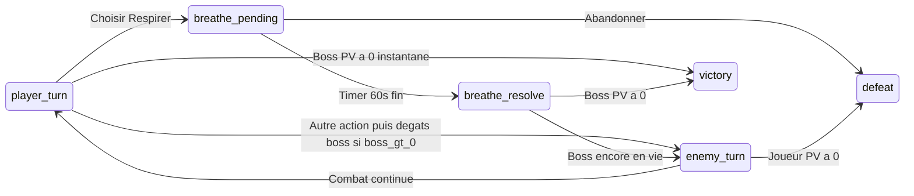

# Spec combat tour par tour — AshHero

Document de référence pour l’implémentation (hook `useTurnCombat`, `CombatModal`, `BreatheTimer`). Les chiffres sont des **défauts V1** ; on pourra les ajuster après playtests.

---

## 1. Objectifs de design

- Feeling **Pokémon** : deux barres de PV, **un tour joueur** puis **un tour ennemi** (sauf fin de combat).
- **Respirer** : le joueur **lance** l’attaque, puis un **timer d’1 minute** oblige une phase de respiration ; **à la fin du timer**, l’attaque **touche** et inflige des dégâts au boss.
- Les autres attaques (eau, distraction, spéciale) se **résolvent tout de suite** après le choix (pas de timer long), puis tour du boss.
- La **récompense XP** et l’**enregistrement Firestore** restent alignés sur [combatXpTable.ts](../src/features/tracker/combatXpTable.ts) et `useCombat` (victoire / défaite en fin de combat uniquement).

---

## 2. Ressources combat (chiffré)

| Ressource | Valeur V1 | Note |
|-----------|-----------|------|
| **PV max joueur** | `100` | Représente calme / volonté (nom d’affichage UI au choix). |
| **PV max boss** (`L’Envie`) | `100` | Même ordre de grandeur pour lire vite les barres. |
| **PV à l’entrée en combat** | Joueur = max, Boss = max | Reset à chaque ouverture de modale. |

---

## 3. Dégâts infligés au boss (par action joueur)

On aligne les **dégâts** sur la même échelle que la table XP existante (lisibilité : une action = un ordre de grandeur cohérent).

| Action | ID technique | Dégâts au boss | XP en cas de victoire (inchangé, [combatXpTable](../src/features/tracker/combatXpTable.ts)) |
|--------|----------------|----------------|---------------------------------------------------------------------------------------------|
| Respirer | `breathe` | **20** | 20 |
| Boire de l’eau | `water` | **15** | 15 |
| Se distraire | `distract` | **10** | 10 |
| Attaque spéciale | `special` | **40** | 40 |

- **Attaque spéciale** : déblocage inchangé côté règle produit (ex. `bestStreak >= 7` dans [useCombat.ts](../src/features/tracker/hooks/useCombat.ts)) ; si non disponible, bouton désactivé.

---

## 4. Attaques du boss (riposte)

Chaque fois que le boss joue son tour (après résolution complète de l’action joueur, voir §5) :

| Paramètre | Valeur V1 |
|-----------|-----------|
| Dégâts de base | **12** PV au joueur |
| Variation aléatoire | **±4** (donc plage **8–16** inclusive, entier) |
| Nom d’affichage (exemples) | Tirer au sort dans une petite liste (*Rafale d’envie*, *Pic de stress*, *Brume irritante*) — texte uniquement, pas d’effet de type différent en V1 |

Si les **PV joueur** tombent à **0** : **défaite** immédiate (même logique métier qu’aujourd’hui : `loseCombat` + fermeture).

---

## 5. Ordre d’un tour (machine d’états)

### 5.1 Tour joueur — actions **sans** Respirer (`water` | `distract` | `special`)

1. État UI : `player_turn` — le joueur choisit une action.
2. Clic → `resolving_instant` (court, optionnel : 200–400 ms ou ligne de texte « Tu utilises … ! »).
3. Appliquer **dégâts au boss** ; clamp `bossHp ∈ [0, max]`.
4. Si `bossHp === 0` → **victoire** → `handleVictory(action)` puis écran de fin (comme aujourd’hui).
5. Sinon → **tour boss** (§5.3).

### 5.2 Tour joueur — action **Respirer** (`breathe`)

1. État UI : `player_turn` → le joueur choisit **Respirer**.
2. Passage immédiat à `breathe_pending` :
   - Message du type : *« Concentre-toi : respire jusqu’à la fin du temps. »*
   - Lancer le **timer 60 secondes** (comportement actuel de [BreatheTimer.tsx](../src/features/combat/components/BreatheTimer.tsx) : `TOTAL_SECONDS = 60`).
3. Pendant `breathe_pending` :
   - **Pas** de dégâts au boss encore.
   - **Pas** de tour du boss.
   - Boutons d’autres attaques **désactivés** ou masqués (éviter double lancement).
   - **Abandonner** : comporte comme aujourd’hui → `handleDefeat` + fermeture (défaite volontaire), sans infliger de dégâts au boss pour cette action.
4. Quand le timer atteint **0** :
   - Transition vers `breathe_resolve`.
   - Appliquer **20** dégâts au boss (table §3).
   - Si `bossHp === 0` → **victoire** → `handleVictory('breathe')` + fin.
   - Sinon → **tour boss** (§5.3).

**Annulation / sortie avant 60 s** : non prévu en V1 (pas de bouton « skip ») — le jeu veut forcer la minute de respiration. Si plus tard tu veux un abandon mid-respiration, trancher : soit abandon = défaite (comme maintenant), soit retour au choix d’actions sans dégâts (à documenter séparément).

### 5.3 Tour boss (riposte)

1. État UI : `enemy_turn` — input joueur **désactivé**. Délai configurable dans `useTurnCombat` : pause après le coup joueur puis délai avant la riposte (voir `PAUSE_AFTER_PLAYER_HIT_MS` / `ENEMY_ATTACK_DELAY_MS`).
2. Tirer les dégâts **8–16** (§4), les appliquer au joueur ; clamp `playerHp ∈ [0, max]`.
3. Afficher une ligne de log : *« L’Envie utilise [nom] ! »* + *« −X PV »* (optionnel V1).
4. Si `playerHp === 0` → **défaite** → `handleDefeat` + fermeture.
5. Sinon → retour **`player_turn`**.

---

## 6. Synthèse du graphe (simplifié)

---

## 7. Cohérence avec l’architecture

- **Hook dédié** (ex. `useTurnCombat`) : contient PV, état de tour, RNG boss, application des dégâts ; **aucun** appel Firebase dans le hook si on garde la persistance dans `useCombat`/`handleVictory`/`handleDefeat` comme aujourd’hui.
- **`CombatModal`** : branche l’UI sur les états ; `BreatheTimer` uniquement en `breathe_pending`.
- **Zustand** : pas besoin de dupliquer les PV du combat dans le store global ; mise à jour profil **uniquement** à la fin (victoire/défaite), conformément au flux actuel.

---

## 8. Checklist d’implémentation

- [ ] PV joueur + PV boss affichés (layout type « deux cadres »).
- [ ] États `player_turn` | `breathe_pending` | `enemy_turn` | fin.
- [ ] Respirer : 60 s puis dégâts 20 au boss puis riposte boss si besoin.
- [ ] Autres actions : dégâts immédiats puis riposte boss.
- [ ] Abandon : défaite ; pendant Respirer, abandon = défaite sans dégâts boss sur cette action (comme §5.2).
- [ ] Une seule fois `handleVictory` / `handleDefeat` par combat.
- [ ] Tests unitaires sur le hook : séquence dégâts, boss mort avant riposte, joueur mort sur riposte.

---

## 9. Ajustements futurs (hors V1)

- Courbe de difficulté (dégâts boss qui montent avec le niveau ou la série).
- Effets de statut (esquive, charge en 2 tours) — complexifie la spec.
- Sons / vibrations sur tour ennemi.
